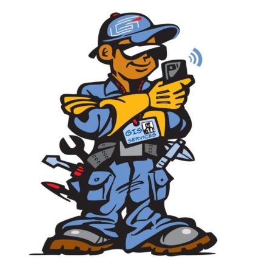

# Severino 
É um simples gerenciador de tarefas com interface HTTP e MySQL como banco de dados.



## Configuração

Você pode instalar este serviço com esse comando:
```
go get github.com/sl4ureano/Severino
```
Navegue para o diretório severino:

```
Instale o https://github.com/tools/godep
```
instale as dependências:
```
godep restore
```
Crie o binário:
```
go build
```
Isso criará um binário chamado severino, crie um arquivo .env na raiz do projeto com este conteúdo:
```
MYSQL_DB=root:password@tcp(localhost:3306)/severino?charset=utf8&parseTime=True
GIN_MODE=release
PORT=8080
```
defina a variável de ambiente:
```
export SEVERINO=dev
```
Execute o servidor:
```
./severino
```
Seu servidor está rodando!

## API REST

Você pode gerenciar as tarefas no servidor pela API

## Criando uma tarefa
```
POST http://localhost:8080/tasks
{
    "id": "task-id",
    "periodicity": "@every 1m",
    "command": "curl https://api.ipify.org?format=text"
}
```
Formato usado para periodicidade do job
```
Entry                  | Description                                | Equivalent To
-----                  | -----------                                | -------------
@yearly (or @annually) | Run once a year, midnight, Jan. 1st        | 0 0 0 1 1 *
@monthly               | Run once a month, midnight, first of month | 0 0 0 1 * *
@weekly                | Run once a week, midnight on Sunday        | 0 0 0 * * 0
@daily (or @midnight)  | Run once a day, midnight                   | 0 0 0 * * *
@hourly                | Run once an hour, beginning of hour        | 0 0 * * * *
```
Veja mais em https://godoc.org/gopkg.in/robfig/cron.v2

## Parando uma tarefa
```
DELETE http://localhost:8080/tasks/task-id
```
```
POST http://localhost:8080/tasks
{
    "id": "task-id",
    "periodicity": "stop",
    "command": "curl https://api.ipify.org?format=text"
}
```

## Listando tarefas
```
GET http://localhost:8080/tasks
```

## Listando uma tarefa específica
```
GET http://localhost:8080/tasks/task-id
```

Sinta-se livre para contribuir e relatar bugs.

Desenvolvido com ❤️ no vale tecnológico da Baixada Fluminense.
